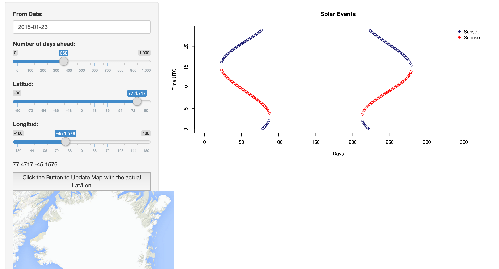

Shiny App Presentation: Solar Sunrise & Sunset around the World from a date
========================================================
author: Xavi Jacas
date: 23-1-2015

```
                   sunrise              sunset
newlon 2015-01-01 05:59:41 2015-01-01 18:07:10
```
https://xavijacas.shinyapps.io/ShinyApp

Presentation
========================================================
<small style="font-size:.8em">
This Shiny App, Solar Sunrise & Sunset around the World from a date, tries to show the diferences in Time of the Solar events, sunrise, sunset, around the World.

By default the app tries to geolocate de visit, and if is permited, the sunrise and sunset events for that position are show, for the next year since the actual date.

Once that is done, the user can change:

  - Date
  - time period to show (days from today for whom will be calculated the events)
  - Latitud
  - Longitud
  - a button to update de map to see the map part of that part world (by lat/lon)
  
the graphic shows sunrise and sunset Times for this variables.

</small>

UI.R
========================================================
UI.R code, can be found:
https://github.com/existeundelta/ShinyApp/blob/master/ui.R

see the use of: 

```r
l
    tags$div(HTML('
       ...       '))
```
to directly put html in the UI


Server.R
========================================================

Server.R code, can be found:
https://github.com/existeundelta/ShinyApp/blob/master/server.R

the function to get the solar events data, get.sunrise is:

```r
get.sunrise <- function(lat, lon, date, n){
  tmp <- sunrise.set(lat, lon, date, timezone="UTC", num.days = n)  
  solar <- tmp
  solar$sunrise <- POSIXctToHour(tmp[,1]) 
  solar$sunset <- POSIXctToHour(tmp[,2])

  return (solar)
}
```
using library(StreamMetabolism)

Example, Greenland
========================================================



<small style="font-size:.3em">
ref:
http://artax.karlin.mff.cuni.cz/r-help/library/StreamMetabolism/html/sunrise.set.html
http://stat.ethz.ch/R-manual/R-devel/library/graphics/html/hist.POSIXt.html
http://www.w3schools.com/htmL/html5_geolocation.asp
http://www.w3schools.com/htmL/tryit.asp?filename=tryhtml5_geolocation_map
http://www.datanalytics.com/2014/10/14/amanece-me-cuenta-que-no-es-poco/
</small>
